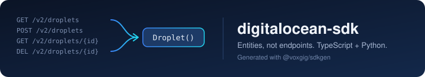

# DigitalOcean SDK

[](https://github.com/pratik-mahalle/digitalocean-sdk/actions/workflows/ci.yml)
[](https://github.com/pratik-mahalle/digitalocean-sdk/actions/workflows/docgen.yml)
[](./LICENSE)

TypeScript and Python clients for the [DigitalOcean API](https://docs.digitalocean.com/reference/api/),
generated from DigitalOcean's official OpenAPI spec with [`@voxgig/sdkgen`](https://github.com/voxgig/sdkgen).

> **Unofficial.** This SDK is not affiliated with, endorsed by, or sponsored by DigitalOcean.

## Why this SDK

- **Entities, not endpoints.** Call `client.Droplet().list()` instead of building `/v2/droplets?page=...` by hand.
  The API's 515 paths are grouped into 235 entities, each with the same small set of operations.
- **Two languages, one model.** TypeScript and Python are generated from the same model, so they behave the same way.
- **Offline test mode.** Every client ships with an in-memory mock, so your unit tests run with no network and no token.
- **Tested.** 1,954 TypeScript and 1,231 Python offline tests pass in CI, and read-only calls are verified against the live API.

## Install

Neither package is published to a registry yet. Install from this repository.

**TypeScript / JavaScript** (Node 22.13+)

```bash
git clone https://github.com/pratik-mahalle/digitalocean-sdk
npm install ./digitalocean-sdk/ts
```

**Python** (3.8+)

```bash
pip install "git+https://github.com/pratik-mahalle/digitalocean-sdk#subdirectory=py"
```

## Quickstart

Create a [personal access token](https://cloud.digitalocean.com/account/api/tokens) and export it:

```bash
export DIGITALOCEAN_TOKEN=dop_v1_...
```

**TypeScript**

```ts
import { DigitaloceanSDK } from '@voxgig-sdk/digitalocean-sdk'

const client = new DigitaloceanSDK({ apikey: process.env.DIGITALOCEAN_TOKEN })

// Every operation resolves to entities; call .data() for the plain record.
const account = await client.Account().load({})
console.log(account.data().droplet_limit)

const regions = await client.Region().list({})
for (const region of regions) {
  console.log(region.data().slug)
}
```

**Python**

```python
import os
from digitalocean_sdk import DigitaloceanSDK

client = DigitaloceanSDK({"apikey": os.environ["DIGITALOCEAN_TOKEN"]})

account = client.Account().load({})
regions = client.Region().list({})
print(len(regions), "regions")
```

Errors are raised (Python) or thrown (TypeScript) with the HTTP status in the message, for example
`DigitaloceanSDK: load: request: 401: Unauthorized`.

<p align="center">
  
</p>

## Entities

Each entity supports the subset of `list`, `load`, `create`, `update`, `patch` and `remove` that the API offers.
Some common ones:

| Area | Entities |
| --- | --- |
| Compute | `Droplet`, `Image`, `Snapshot`, `SshKey`, `Size`, `Region` |
| Storage | `BlockStorage`, `ContainerRegistry` |
| Networking | `Vpc`, `Firewall`, `LoadBalancer`, `ReservedIp`, `Domain`, `DomainRecord`, `CdnEndpoint`, `Certificate` |
| Platform | `App`, `Database`, `Kubernete`, `FunctionNamespace`, `MonitoringAlert` |
| Account | `Account`, `Project`, `Tag`, `Action` |

The full list, with every operation and parameter, is in each language's reference:
[TypeScript](./ts/REFERENCE.md) · [Python](./py/REFERENCE.md).

Nested resources take their parent's ID as a parameter:

```ts
const records = await client.DomainRecord().list({ domain_name: 'example.com' })
```

## Offline testing

`DigitaloceanSDK.test()` returns a client backed by an in-memory store. Seed it with the records a test needs:

```ts
const client = DigitaloceanSDK.test({
  entity: { droplet: { d1: { id: 'd1', name: 'web-1' } } },
})

const droplets = await client.Droplet().list({})
console.log(droplets[0].data().name) // web-1
```

## Known limitations

- **Paging is off by default.** `list()` returns the first page only, which is 20 records on DigitalOcean.
  For example, `Size.list()` returns 20 of 43 sizes. Pass `page` and `per_page` to fetch more.
- **Multi-droplet create** (`names: [...]`) returns the raw `{ droplets: [...] }` body. Single-droplet create
  returns the droplet itself.
- **Some entity names come straight from the generator**, such as `Kubernete` for Kubernetes clusters.
- Three load-only nested entities skip their generated flow test because of a generator bug. The reasons are
  recorded in `ts/test/sdk-test-control.json`.

## Development

The language directories (`ts/`, `py/`) are generated. Change the model, not the output:

```bash
cd .sdk
npm install
npm run generate          # regenerate ts/ and py/ from the model
cd ../ts && npm run build && npm test
cd ../py && python -m pytest
```

| Path | Purpose |
| --- | --- |
| `.sdk/def/` | The DigitalOcean OpenAPI spec (JSON) |
| `.sdk/model/guide/guide.aontu` | Hand-written model shaping: entity splits, parameter renames, response unwrapping |
| `.sdk/model/project.aontu` | Project settings: repository, publisher |
| `examples/live-smoke.js` | Read-only check against the live API |

Run the live check with `DIGITALOCEAN_TOKEN=... node examples/live-smoke.js`.

[`AGENTS.md`](./AGENTS.md) covers the generator workflow in detail, and [`REPORT.md`](./REPORT.md) records the
developer experience of building this SDK, including the issues found and how each was fixed.

## License

[MIT](./LICENSE) © Pratik Mahalle. The DigitalOcean API spec is © DigitalOcean, LLC, under the Apache 2.0 license.
